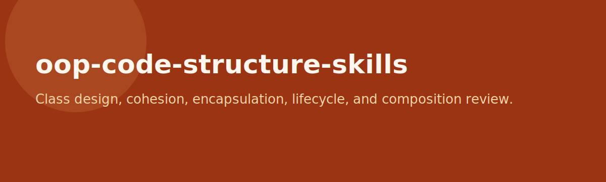

# oop-code-structure-skills

<p align="center">
  
</p>

<p align="center">
  
</p>

<p align="center">
  <a href="LICENSE"></a>
  
  
</p>

A platform-neutral object-oriented code structure skill pack for class design, cohesion, encapsulation, lifecycle decisions, equality semantics, visibility, and inheritance versus composition review.

## Included skills

- `class-responsibility-checker`
- `encapsulation-reviewer`
- `constructor-sanity-checker`
- `equals-hashcode-reviewer`
- `static-vs-instance-reviewer`
- `method-cohesion-checker`
- `overloading-overriding-reviewer`
- `inheritance-vs-composition-advisor`
- `visibility-modifier-reviewer`
- `immutability-opportunity-finder`
- `object-lifecycle-reviewer`
- `naming-and-abstraction-reviewer`

## Features

- Preserves the original `skills/`, `templates/`, and `examples/` source material
- Mirrors packaged skills into both `.claude/skills/` and `.agents/skills/`
- Focuses on maintainable class design and object modelling decisions

## Install

### Option A: Install globally

```bash
git clone https://github.com/45ck/oop-code-structure-skills.git
cd oop-code-structure-skills
bash install.sh
```

This installs every packaged skill into both:

- `~/.claude/skills/`
- `~/.agents/skills/`

### Option B: Copy into a project

```bash
cp -R .claude /path/to/your-project/
cp -R .agents /path/to/your-project/
```

### Uninstall

```bash
bash uninstall.sh
```

## Usage

```text
/class-responsibility-checker current OrderService design
/encapsulation-reviewer domain model package
/constructor-sanity-checker aggregate creation flow
/inheritance-vs-composition-advisor notification strategy
/immutability-opportunity-finder current DTO and value objects
/naming-and-abstraction-reviewer service and repository layer
```

## Repo structure

```text
skills/                              original source skills
templates/                           reusable templates
examples/                            sample flow material
.claude/skills/<skill>/SKILL.md      packaged skill format
.agents/skills/<skill>/SKILL.md      mirrored packaged skill format
install.sh                           global installer
uninstall.sh                         global uninstaller
LICENSE                              MIT
```

## Related skill packs

- [data-structures-algorithmic-reasoning-skills](https://github.com/45ck/data-structures-algorithmic-reasoning-skills) - Data structure selection and algorithmic reasoning skills
- [software-architecture-skills](https://github.com/45ck/software-architecture-skills) - Architecture options, views, risks, and tradeoff writing
- [web-engineering-skills](https://github.com/45ck/web-engineering-skills) - Web request handling, MVC, validation, routing, and navigation skills
- [backend-persistence-skills](https://github.com/45ck/backend-persistence-skills) - Persistence, schema, ORM, query, and migration skills
- [enterprise-architecture-integration-skills](https://github.com/45ck/enterprise-architecture-integration-skills) - Enterprise topology, integration, messaging, and cloud skills
- [uml-analysis-modelling-skills](https://github.com/45ck/uml-analysis-modelling-skills) - UML analysis and modelling skills
- [business-analysis-skills](https://github.com/45ck/business-analysis-skills) - Business analysis techniques, workflows, and quality checks
- [marketing-product-skills](https://github.com/45ck/marketing-product-skills) - Product strategy, growth, positioning, launch, SEO, and pricing skills
- [hci-review-skill](https://github.com/45ck/hci-review-skill) - Structured HCI and UX review skills
- [fagan-inspection-skill](https://github.com/45ck/fagan-inspection-skill) - Formal inspection and defect-review skills

## License

[MIT](LICENSE)
